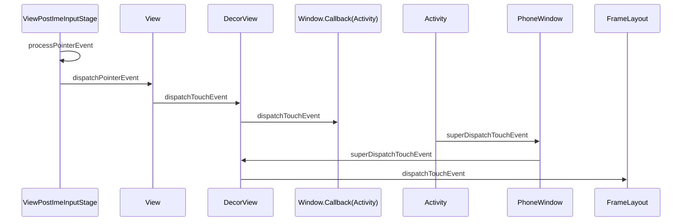

# View

基础问题：

- 事件分发机制

- 绘制流程

- 自定义View/ViewGroup

进阶问题:

- Choreographer是什么?

## 一、事件分发机制

分发的是什么?MotionEvent,事件

给谁用?具体的View消费

dispatchTouchEvent

onInterceptTouchEvent

onTouchEvent

View

dispatchTouchEvent->onTouchEvent

ViewGroup：

dispatchTouchEvent->onInterceptTouchEvent->View.dispatchTouchEvent->ViewGroup.onTouchEvent

dispatchTouchEvent：收到事件了，该事件在本范围内是否消费

onInterceptTouchEvent：是否拦截不让子View去消费

onTouchEvent：自己是不是消费

事件序列：由ACTION_DOWN开始，ACTION_UP/ACTION_CANCEL结束

事件被某个View消费开始，后续事件不需要再遍历

onInterceptTouchEvent返回true后，该事件序列内不会再调用

Activity->ViewGroup->View

解决滑动冲突的方案：（同方向，不同方向（NestedScrollView已经解决了）

1. 内部解决：disallowParentInterceptTouchEvent，禁止父View的进行拦截
2. 外部解决法：onInterceptTouchEvent，拦截子View的消费

NestedScrollView机制：

子View先给父View看看要不要消费，父View消费完后剩余的事件子View消费，然后再把子View未消费完的传给父View

## 绘制流程

前提：

setContentView将xml布局生成对应的View；

初次绘制：

ActivityThread.handlerResumeActivity

思路：

开发者自定义View如何实现想要的控件呢？

View的onMeasure、onLayout、onDraw三个方法

onMesure又是在measure方法里执行的；

onLayout在layout方法里调用

onDraw在draw方法里调用

最终的入口ViewRootImpl.setView(decorView, windowLayoutParam)，通过Choreographer来管理发起绘制请求，以及接收硬件的绘制回调，然后让具体的View执行绘制

- measure
- layout
- draw

measure最终调用onMeasure方法，重写该方法实现对控件尺寸的测量

View.onMeasure：

形参MeasureSpec包含两部分：高两位模式，低30位数值，是根据父View的LayoutParams和子View的尺寸（width/height)生成的期望

getMeasureSize

getMeasureMode

measureMode有三种：

UNSPECIFIED

AT_MOST

EXACTLY

resolveSizeAndState根据自身测出的尺寸以及自己的measureSpec算出最终的measureSize

AT_MOST：

尺寸是measureSize

EXACTLY

尺寸是measureSize

UNSPECIFIED:

最大的尺寸

.png)

自定义View，调用setMeasuredDimension设置View的measureWidth，measureHeight

**ViewGroup的onMeasure**

遍历View的onMeasure，然后设置自己的尺寸,以LinearLayout，orientation为VERTICAL为例

ViewGroup对child的测量关键是ViewGroup.measureChildWithMargins->ViewGroup.getChildMeasureSpec

根据ViewGroup的measureSpec和View设置的LayoutParams来设置Child.measure内的widthMeasureSpec和heightMeasureSpec

父View的MS为EXACTLY：

child是固定尺寸则为固定尺寸，且child的MS为EXACTLY

child是MATCH_PARENT/WARP_CONTENT，则specSize为父View的size，speacMode为AT_MOST

父View的SpecMode为AT_MOST

child是固定尺寸，则speaceSize为固定尺寸，speacMode为EXACTLY

child是MATCH_PARENT/WRAP_CONTENT，specSize为父View的specSize，mode为AT_MOST

UNSPECIFIED

child是固定尺寸，则size为固定尺寸，mode为EXACTLY

MATCH_PARENT/WRAP_CONTENT,size为0，mode为UNSPECIFIED

记录height，以及maxWidth，然后根据measureSpec和height和maxWidth算出LinearLayout的measureWidth和measureHeight

### layout

View的layout设置left、top、right、bottom的位置，调用onLayout，空实现

**ViewGroup的layout**

流程与View一致，在onLayout里遍历子View调用子View的layout方法进行布局

以竖向的LinearLayout为例，遍历子View以当前的初始length定top来设置left、right、top、bottom

### draw

1. 绘制背景
2. onDraw：自身的绘制
3. disaptchDraw：子View的绘制
4. onDrawForeground绘制前景、滑动条

View

onDraw，自定义View绘制内容

ViewGroup

disaptchDraw->drawChild->View.draw

onDraw:绘制自己的内容

事件接收的入口：

ViewRootImpl#ViewPostImeInputStage.processPointerEvent

1. ViewRootImpl收到事件
2. 给View，即为DecorView
3. DecorView给Activity（Window.callback）
4. Activity给PhoneWindow
5. PhoneWindow给DecorView

转了一圈又回到了DecorView，这里只是为了让Activity/Dialog能够得到分发的机会，在View都不处理的情况下Activity的onTouchEvent可以做一些处理

