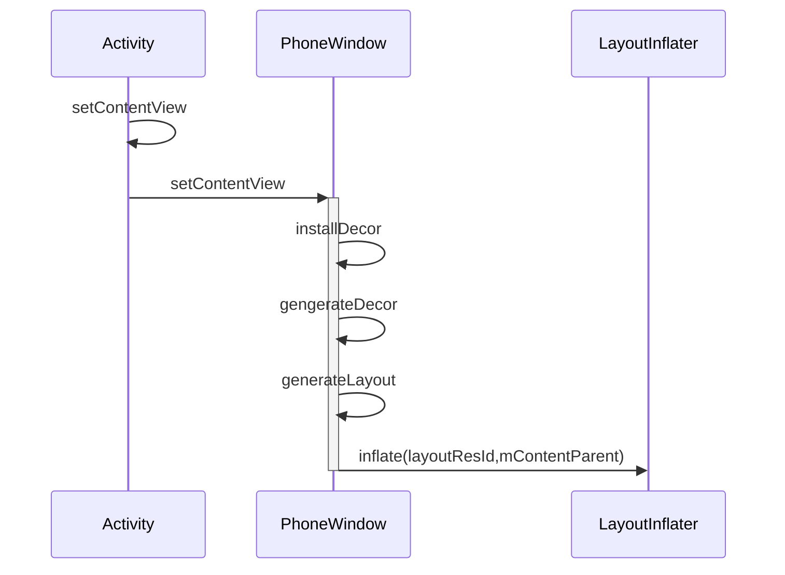
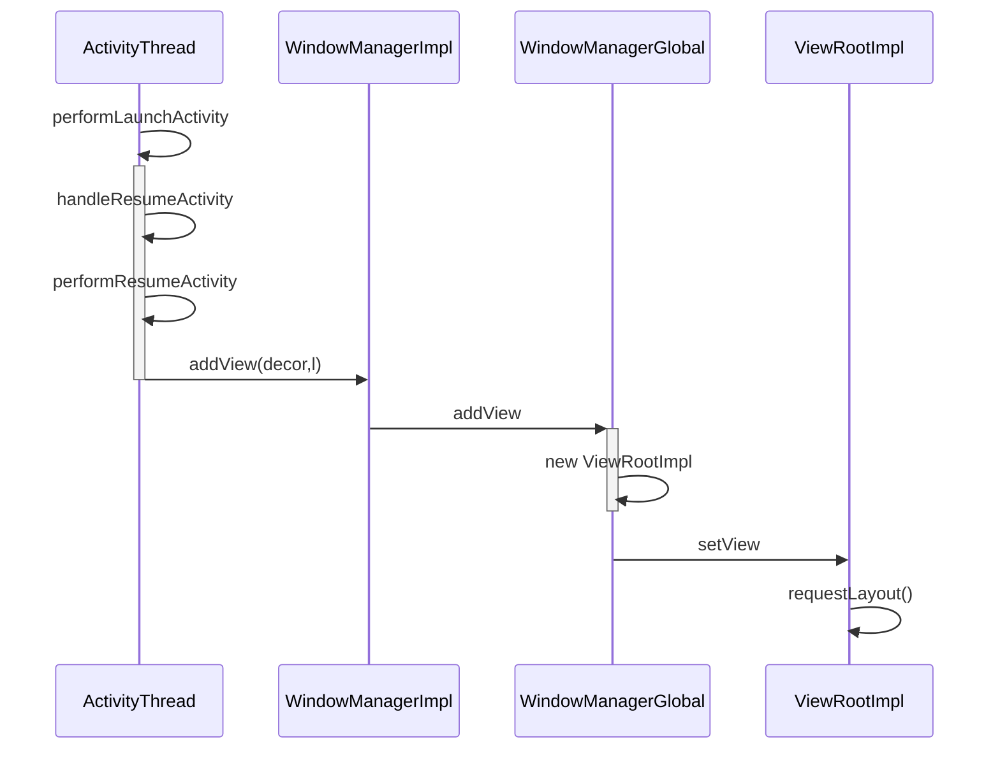
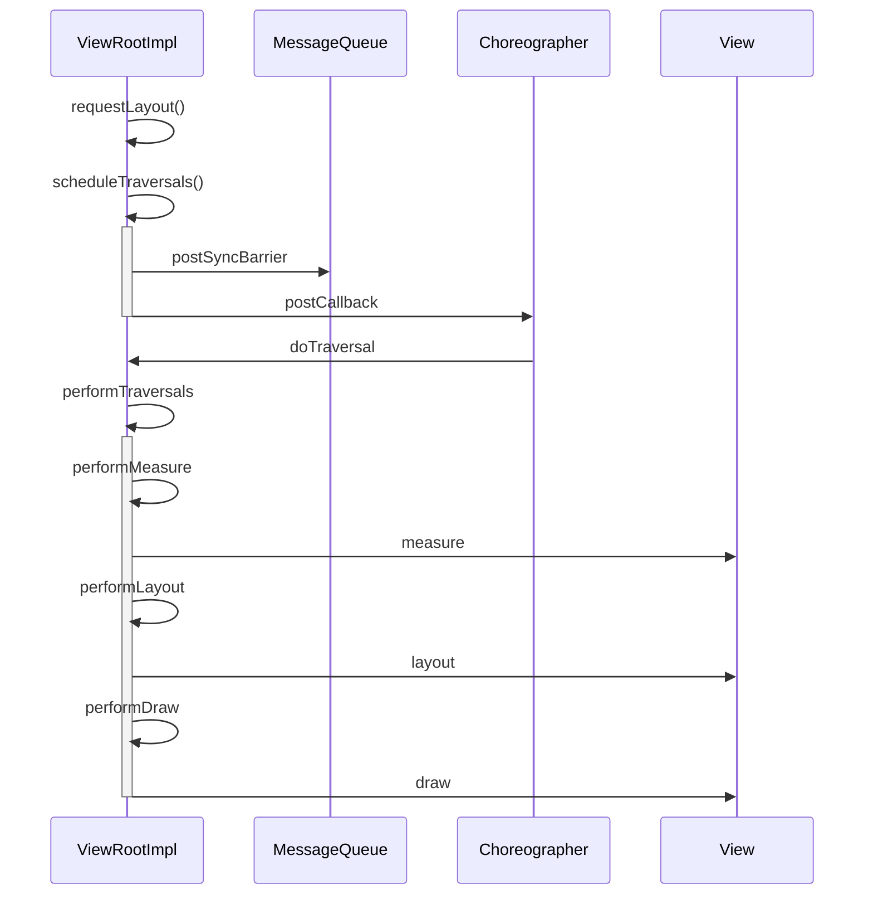

setContentView的过程

generateLayout:

初始布局的xml文件R.layout.screen_simple，设置layoutResId放在id为R.id.content的FrameLayout内

总结：在PhoneWindow进行setContentView，包含初始的布局，利用LayoutInflater解析xml文件，得到View，并添加到contentParent内，只是将布局文件解析到Java内未进行绘制

## 二、绘制

绘制入口:ActivityThread.handleResumeActivity

经过WindowMangerImpl和WMGlobal后，最终通过新建的ViewRootImpl，设置DecorView，执行requestLayout请求绘制

真正的绘制核心：

