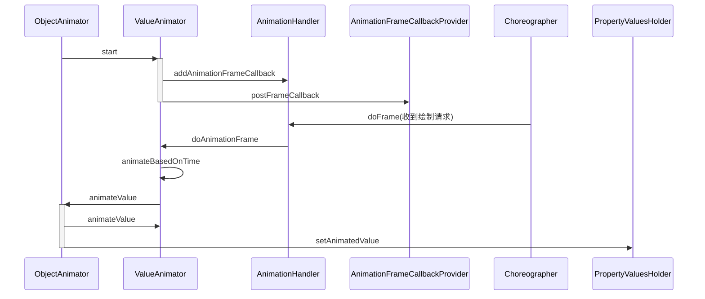

属性动画

使用

```java
 ObjectAnimator objectAnimator = ObjectAnimator.
                ofFloat(button, "scaleX", 2f);
        objectAnimator.setDuration(3000);
        objectAnimator.start();
```

首先初始化目标类，属性名，关键帧



设置Choreographer的动画回调，在下一帧收到调用后通过插值器算出当前值，用反射修改属性