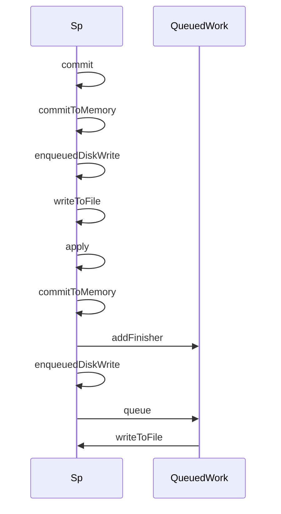

SharedPreference

关键方法：

1. startLoadFromDisk：从磁盘加载sp文件
2. writeToFile：更新sp文件
3. QueuedWork.addFinisher(awaitCommit)：将更新的任务添加到sFinishers链表
4. QueuedWork.queue：将任务添加到sWork的异步任务链表中
5. enqueuedDiskWrite：commit/apply最终都会执行的方法
6. commitToMemory：将修改更新到内存

涉及的Runnable:

awaitCommit：通过CountDownLatch等待更新sp执行完成

postWrite：执行awiat，完成后将任务从sFinisher中移除

writeToDisk：更新sp文件

为了保证线程安全，提供的三把锁：

mLock

mEditorLock

mWriteToDiskLock


SharedPreference apply导致ANR的原因分析：

apply，构造了awaitCommit的Runnable（加了CountDownLatch等待执行完），将awaitCommit添加到了QueuedWork的链表里，postWriteRunnable主要的作用是执行awaitCommit，并将它移除QueuedWork，

接下来执行到SPImpl的enqueueDiskWrite（postWriteRunnable），这里构造了第三个writeToDiskRunnable

awaitCommit->postWriteRunnable->writeToDiskRunnable

```
writeToDiskRunnable明显是真正执行的，加锁执行writeToFile，这里就是写入了->执行postWriteRunnable
```

writeToDiskRunnable是在子线程->postWriteRunnable也是子线程->也是awaitCommit


基本使用

三种创建方式：

activity.getSp(String name, int mode);

PreferenceManager.getDefaultSharedPreferences

context.getSP(String name, int mode)

最终都是调ContextImpl的getSp(String  name, int mode);

创建后会将SP用静态ArrayMap进行缓存，保证一个SP只有一个实例（尽早实例化）

new时

1、创建临时文件，用于失败时的回滚；

2、mMap存储加载出来的key-value；

3、通过mLoaded检测整个加载的完成

4、在子线程加载xml文件，加载后在加锁的情况下修改mLoaded值；

getXxx方法：

加锁去取mMap里存储的value

putXxx方法

将key-value存储在map里，还没有修改；

commit方法：（子线程执行writeToFile，调用线程CountDownLatch.wait）

同步，用CountDownLatch加锁等待该任务的完成，任务最终会去修改xml文件，等到任务完成被唤醒后返回修改结果

修改本地的Map，然后将新的结果写入xml


apply卡顿的原因：提交的任务会被提交到QueuedWork的链表里，而Activity的onPause时或BroadcastReceiver.onReceive后，或者Service处理后都会调用QueuedWork.waitToFinish等待任务完成，so造成了主线程的ANR->怎么解决呢？第一种减少频繁的apply，第二种：应该可以在子线程执行commit，这样就没事了

两者的区别：




## 进程安全

是不是进程安全？NO！

如果保证？

文件锁

ContentProvider来访问Sp

## 引申

其他的开源库：

微信的MMKV；

JetPack的DataStore


SP是通过ContextImpl.getSp获取的，那是不是ContextImpl只有一个实例，不然会创建无数的SP实例->不会缓存是全局的