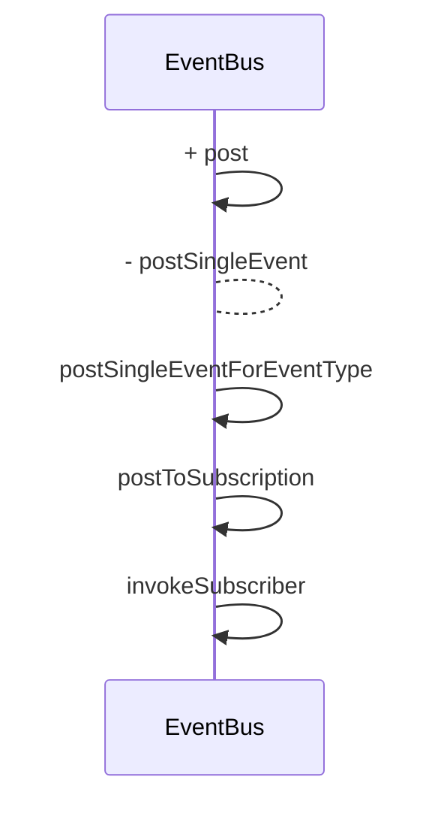

EventBus分析

```java
	// 1、注册总线
	EventBus.getDefault().register(this)

	// 2、接收事件类型
    @Subscribe(threadMode = ThreadMode.MAIN)
    public receiveMessage(String content){
    	...
	}
	
	// 3、注销
	EventBus.getDefault().unregister(this)
```

## 一、注册

```java
EventBus.register(...)->SubscriberMethodFinder.findSubscriberMethods获取该类所有订阅的方法
```

SubscriberMethod：订阅事件的处理方法，包含事件接收时的线程模式，优先级，以及是否粘性

EventBus.subscribe(subscriber,subscribeMethod)

```
// key为类，value为该类的所有订阅者，该列表根据优先级进行排序
private final Map<Class<?>, CopyOnWriteArrayList<Subscription>> subscriptionsByEventType;
```

## 二、发送事件



postSingleEventForEventType：根据事件的class，获取所有的订阅者，然后通过反射执行订阅者的接收方法

postToSubscription：根据threadMode和当前执行的线程进行线程切换，然后执行订阅者订阅事件的方法

## 三、注销

与注册是相反的逻辑，获取该订阅者的所有订阅类，然后从subscriptionsByEventType根据订阅类获取到订阅类的所有订阅者，移除该订阅者

## 四、粘性事件

特点：首次发送时与普通事件一样接收，再次订阅时会从stickyEvents获取该订阅对象订阅的所有粘性事件

订阅：某个订阅者的某个订阅类是粘性事件->从stickyEvents获取该粘性事件->通知该订阅者

---

SuscriberMethod：存储订阅的方法，包含方法名，线程模式，订阅的类对象

Suscription：存储订阅者的信息，包含事件和订阅方法