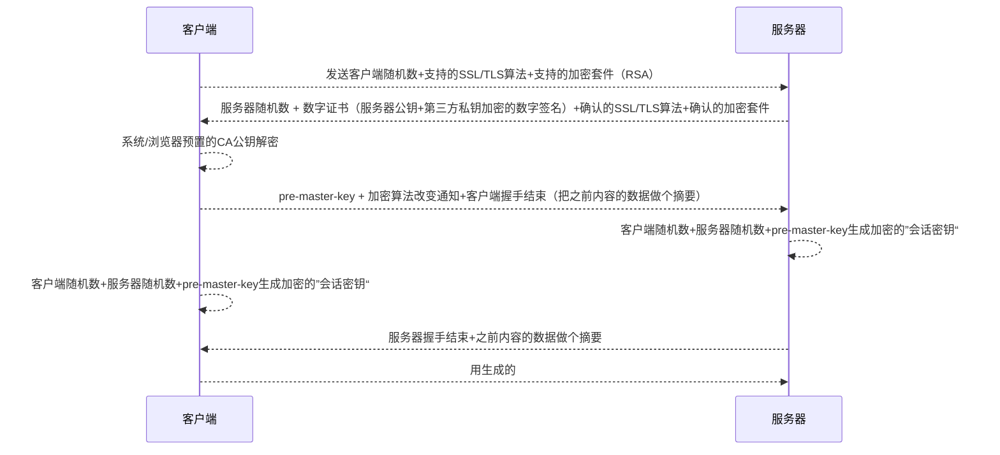

现状：已经有人帮你做好了样板，隐藏了自己的不足，没法应对面试时的需求；

特点：多、碎(跨度跳越)

HTTP是什么？**协议**————超文本传输协议

HTTP的工作方式：
浏览器<=>服务器

包含：请求和响应

URL->HTTP报文

url分为：协议类型、服务器地址、路径

报文格式：Request

Request：请求行、Headers、Body

Response：状态行(HTTP版本、状态码、状态消息)、Headers、Body

Request Methods

1. GET（幂等）：获取资源，没有Body
2. POST：增加或修改资源，有Body
3. PUT（幂等）：修改资源，有Body
4. DELETE（幂等）：删除资源，没有Body
5. HEAD：获取资源，Response不返回Body,*找到目标主机后确认主机域名和端口*

> 幂等：执行一次或多次结果一致

Status Code

- 1xx：提示信息，协议处理中的一种中间状态，实际用到的比较少；100（大文件传输）

- 2xx：请求成功

  200：一切正常

  204：响应头没有body

  206：应用于HTTP分块下载或断点续传，表示还没传完

- 3xx：重定向（请求的url变了）

  301：永久重定向

  302：临时重定向（301、302都会在响应头里加上**Location**告知新的URL）

  304：缓存重定向（重定向已存在的缓冲文件）

- 4xx：客户端请求报文有误，服务器处理不了

  403：服务器禁止

  404：服务器找不到资源

- 5xx：服务器错误

Header

作用：HTTP消息的元数据(metadata)
1. Host：服务器主机地址(不是寻址的，在请求前浏览器已经通过DNS找到对应ip了)（服务器用来对应主机）
2. Content-Type/Content-Length
Content-Type(返回的格式）:
text/html
application/x-www-form-urlencoded:普通表单（要提交的表单，不能传二进制数据)
multipart/form-data：多部分形式，用于传输二进制内容的多项内容（带文件的文本）
application/json：json形式,POST或PUT请求或Response
image/jpeg、application/zip：单文件，响应或POST/PUT请求

3. Location：重定向的目标URL
4. User-Agent：用户代理
5. Range/Accept-Range：指定Body的内容范围
6. Cookie/Set-Cookie
7. Authorization:授权信息

Cache：

1、Cache和Buffer的区别（缓存和缓冲）

Cache：用过的存起来，后面可能用到
Buffer：针对工作流，上流提前加载一部分数据

Cacge-Control：no-cache、no-store、max-age

Last-Modified

Etag

Cacge-Control：private/public（中间节点是否需要帮助缓存、不是加密）

REST

## HTTPS

混合加密：用非对称加密传私钥，传输时用对称加密传输

对称加密：使用一个密钥，运算速度快，密钥必须保密->传密钥无法保证安全性

非对称加密：使用公钥和密钥，公钥随意发，私钥保密，解决了密钥交换问题，但速度慢

**摘要算法**：签名，保证数据完整性，避免篡改

**数字证书**：第三方用自己的私钥，将服务器的公钥进行数字签名并颁发数字证书。保证服务器公钥的可信

客户端请求公钥->服务器发公钥注册到CA->CA用自己的私钥对公钥做数字签名->服务器返回公钥和证书->客户端用CA的公钥确认服务器数字证书的真实性

> 客户端已事先存入了CA的公钥

## HTTP不同版本的区别

HTTP1.0：

明文传输

短连接：频繁进行重复的TCP连接与断开，性能差

串行：当有多个请求时，后面的请求必须等到前面完成才能发起

HTTP/1.1：

优点：

TCP使用长连接，降低了无谓的性能开销

支持**管道**网络传输，一个请求发出去，不必等到响应就可以发第二个请求

缺点：

请求/响应头部未压缩，在首部信息多时容易造成延迟

发送重复的冗长首部

服务器按请求顺序响应，造成**队头阻塞**

没有优先级

服务器只能被动响应

HTTP/2：

优点：

- 基本HTTPS，安全性有保障

- 头部压缩（HPACK算法）

  报文采用二进制形式，报文由报文首部+空行+报文主体改为头信息帧+数据帧，计算机解析更快，提高了传输效率

- 数据流

- 多路复用

  一个连接中并发处理多个请求，而不用按照顺序，解决了队头阻塞问题，降低了延迟

- 服务器推送

  服务器可以主动把客户端需要的资源主动发给客户端